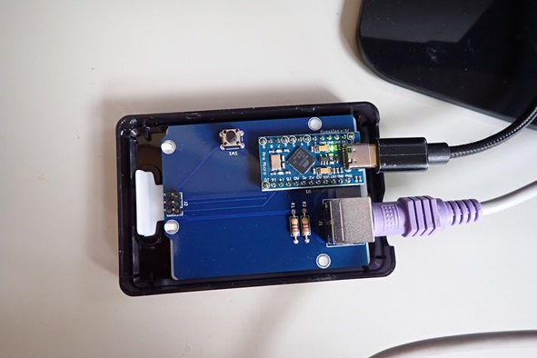

# hoboNicola library for FMV-KB611

本ライブラリはオリジナルのhoboNicola libraryを特定のキーボード向けアダプター用に一部改変したものです。Arduinoのスケッチ部分は \hoboNicolaLibrary_KB611\examples にあります。

アダプターやキーボードの [【実際の写真】](./assets/hobonicola_gallery.md)

## 富士通FMV-KB611
	● 対象アダプター
	ps2_hobo_nicola_KB611  : SparkFun Pro Micro相当品(+5V, 16MHz版)

	設定モードに入るには 右CTRL + MENU(App) + 100ms -> 'S'キー
	● FMV-KB611キーボードの設定モード; *3 + *N + *K

	---------------------------------
	|      F23      |      F24      |	親指シフトキーは内部で使うだけ。
	---------------------------------
            | 無変換 |  変換  |
	        ------------------

	********************************************************
	*** CPU Arduino Leonardo (Arduino AVR Boards)        ***
	********************************************************

	\作業ディレクトリ---+---\ps2_hobo_nicola_KB611---+---ps2_hobo_nicola_KB611.ino
                       |							|
                       |							+---ps2_kbd.cpp
                       |							|
                       |							+---ps2_kbd.h
                       |
                       +---\libralies---+---\Adafruit_TinyUSB_Library
	                                    |
	                                    +---\hoboNicolaLibrary_KB611
